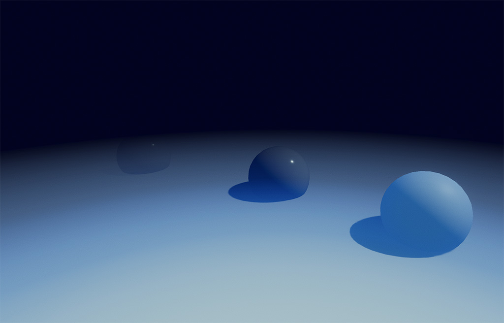
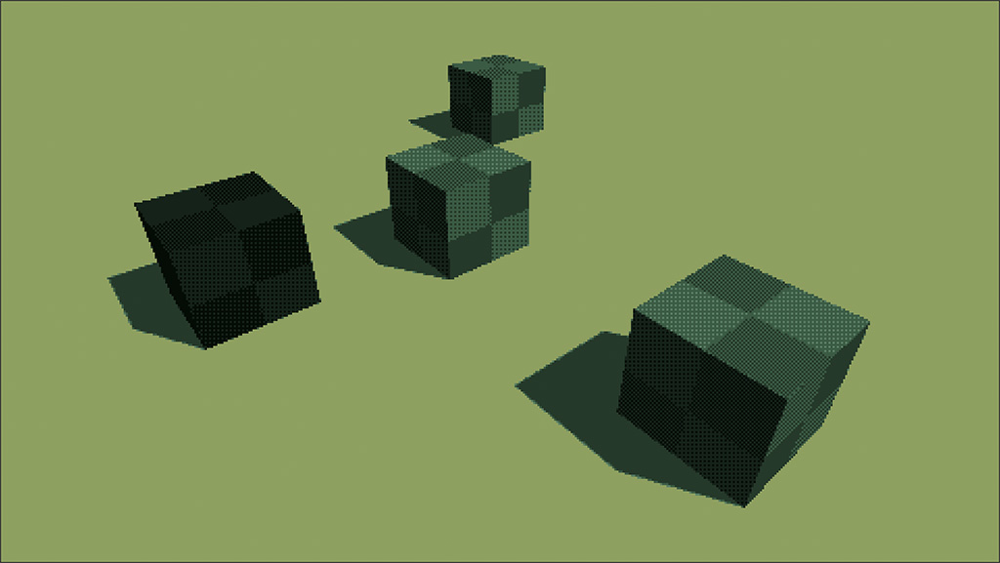
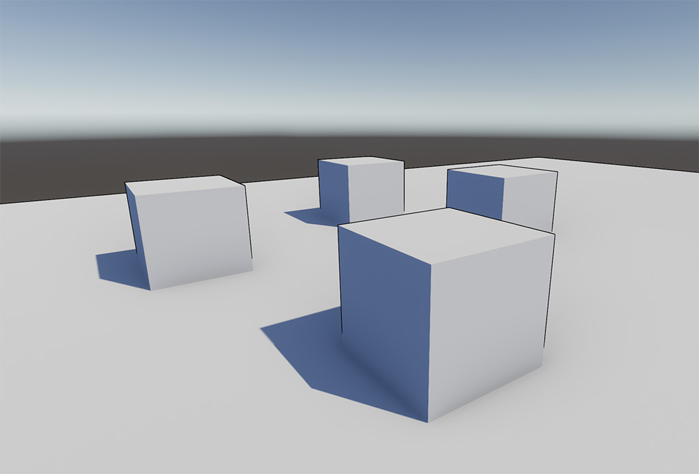

# Effect Documentation
## Dynamic Gradient Fog

A dynamic, blendable fog effect defined using a colour gradient.

See Samples/Fog for example fog gradients.

## Eight Color

An 8-color palette effect with dithering and a low-res look.

The effect is a port of [this effect](https://github.com/keijiro/KinoEight) to the post processing stack. The original was for HDRP.

## Outline

A post-process outline effect with customisable colour.