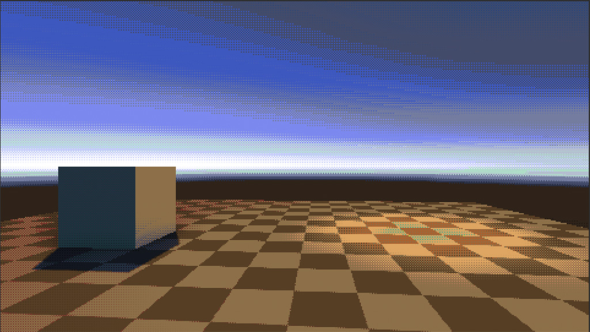
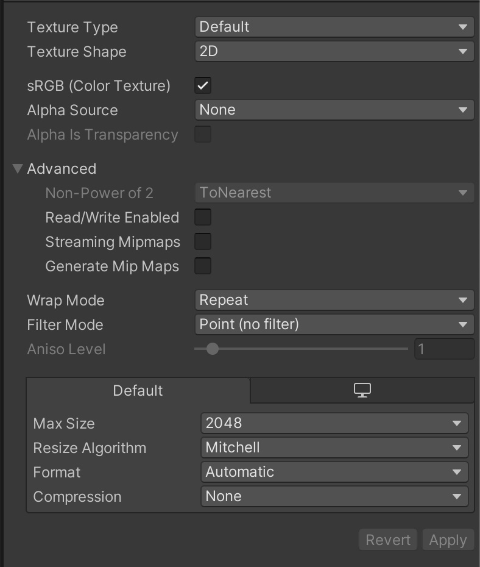

# Effect Documentation
## Dynamic Gradient Fog

A dynamic, blendable fog effect defined using a colour gradient.

See Samples/Fog for example fog gradients.

## Eight Color

An 8-color palette effect with dithering and a low-res look.

The effect is a port of [this effect](https://github.com/keijiro/KinoEight) to the post processing stack. The original was for HDRP.

## Palette

An alternative palette effect that uses LUTs to define colour palettes. Uses the same dithering and settings as Eight Color.

Palettes can be defined using standard 32x1024 lookup tables made in photoshop.

1. Get the neutral LUT texture from the Post Processing Stack. It's in PostProcessing/Textures/LUTs within the package.

2. Get your colour palette as a photoshop palette file. One can be made by opening the palette saved as an indexed png, going to Image->Mode->Color Table... and choosing save.

3. In the neutral LUT texture in photoshop, go to Image->Color->Indexed. Change the palette to custom and load the palette file you saved.

4. Save the indexed palette into your unity project. The import settings that work best are:

This texture should then be assigned to the Palette slot in the Palette effect of your post processing profile.

## Outline

A post-process outline effect with customisable colour.