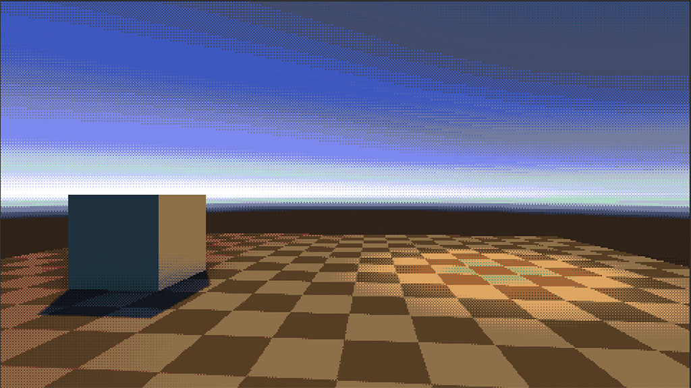

# Post Process Effects

This package contains a number of post processing effects compatible with Unity's post processing stack v2.

## Effects
### Dynamic Gradient Fog

A dynamic, blendable fog effect defined using a colour gradient.

### Eight Color

An 8-color palette effect with dithering and a low-res look.

### Palette

An alternative palette effect that uses LUTs to define colour palettes. Uses the same dithering and settings as Eight Color.

### Outline

A post-process outline effect with customisable colour.

## Usage
The effects can be installed through the Unity package manager, either as a git package or a custom repository source.

## License
Code in this repository is released under the MIT license. See LICENSE for more information.